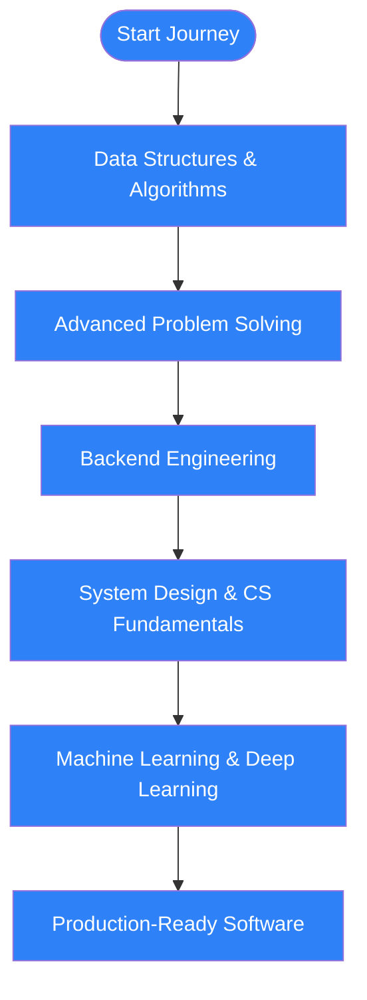

  

  
  
  

---

I build **software products, intelligent systems, and practical machine-learning applications**.  
I'm particularly interested in **DSA, backend engineering, AI/ML, and building production-oriented software**.

  
  
  
  
  
  

---

## 🚀 About Me

- 🎓 B.Tech Computer Science & Engineering student
- 💻 Focused on **Software Development & Product Engineering**
- 🤖 Interested in **Artificial Intelligence, Machine Learning & Deep Learning**
- 🧠 Strengthening **Data Structures, Algorithms & Problem Solving**
- 🏗️ Building projects across **Full-Stack Development, AI/ML & Reinforcement Learning**
- 🏆 **3★ CodeChef**
- 🔍 I enjoy understanding not only *how* something works, but *why* a particular solution or architecture makes sense

---

## 🛠️ Tech Stack

### Languages

  

### Web & Backend

  

### AI / ML

  

**Libraries:** NumPy • Pandas • Scikit-learn • Matplotlib • MediaPipe • Jupyter

### Databases & Tools

  

---

## 🏆 Achievements

### 🎯 Key Milestones

| Milestone | Achievement | Status |
|-----------|-------------|--------|
| 🎯 **LeetCode Mastery** | 427+ Problems Solved (136 Easy, 244 Medium, 47 Hard) | ✅ Active |
| ⭐ **CodeChef Excellence** | 3★ Rating (Current: 2026) | ✅ Achieved |
| 🔥 **GitHub Consistency** | 500+ Contributions with active development | ✅ Ongoing |
| 🏅 **AI/ML Projects** | Deep RL, Computer Vision, NLP implementations | ✅ Completed |
| 📈 **System Design** | Scalable architecture and database design | 🚧 In Progress |
| 🌟 **Open Source** | Contributing to meaningful projects | 🚧 In Progress |

### 📊 Coding Statistics

| Platform | Metric | Value |
|----------|--------|-------|
| 🔥 **LeetCode** | Total Solved | 427+ |
| ⭐ **CodeChef** | Current Rating | 2026 |
| 🏆 **Codeforces** | Max Rating | 1027 |
| 💻 **GitHub** | Total Contributions | 500+ |
| 🎮 **Contests** | Participated | 50+ |

---

## 💻 Competitive Programming

<!-- STATS:START -->
### 📈 Live Coding Progress

| Platform | Progress |
|---|---|
| 🟧 **LeetCode** | **[amansinghnegi](https://leetcode.com/u/amansinghnegi/)**  
Solved: **427** • Easy: **136** • Medium: **244** • Hard: **47** • Rank: **285,402** |
| 🔵 **Codeforces** | **[amansinghnegi](https://codeforces.com/profile/amansinghnegi)**  
Rating: **973** • Max: **1027** • Rank: **newbie** • Max rank: **newbie** |
| 🟫 **CodeChef** | **[amansinghnegi0](https://www.codechef.com/users/amansinghnegi0)** • Rating: **2026** |

> Last automated refresh: **2026-09-20 10:54 UTC**
<!-- STATS:END -->

---

## 📚 Learning Journey

### 🎯 Current Focus Roadmap

### 📖 Detailed Learning Path

| Phase | Focus Area | Technologies | Progress |
|-------|------------|--------------|----------|
| 🧠 **Foundation** | DSA & Problem Solving | Arrays, Trees, Graphs, DP | ████████████████████ 85% |
| 💻 **Backend** | API Development | Node.js, Express, PostgreSQL | ████████████████ 70% |
| 🏗️ **System Design** | Scalable Architecture | Microservices, Caching, Load Balancing | ████████████ 50% |
| 🤖 **AI/ML** | Machine Learning | TensorFlow, PyTorch, Scikit-learn | ████████████████ 75% |
| 🚀 **Production** | DevOps & MLOps | Docker, Kubernetes, CI/CD | ████████ 40% |

### 🎯 Learning Resources

**Courses & Platforms**
- 📚 [LeetCode](https://leetcode.com/u/amansinghnegi/) - Daily problem solving
- 🎓 [CodeChef](https://www.codechef.com/users/amansinghnegi0) - Competitive programming
- 💡 [Codeforces](https://codeforces.com/profile/amansinghnegi) - Algorithm contests
- 📖 [Coursera/edX] - Machine Learning specializations
- 🎥 [YouTube] - System design tutorials

**Practice Areas**
`Arrays` `Strings` `Linked Lists` `Trees` `Graphs` `BFS` `DFS` `Greedy` `Dynamic Programming` `Binary Search` `Heaps` `Hashing` `Recursion`

**Key Concepts**
- Time & Space Complexity Analysis
- Object-Oriented Programming Principles  
- RESTful API Design Patterns
- Database Normalization & Indexing
- Machine Learning Model Deployment
- Containerization & Orchestration

---

## 🎯 2026 Focus

- Strengthen DSA and competitive programming
- Build production-quality full-stack applications
- Deepen CS fundamentals and system design
- Advance ML/DL knowledge
- Contribute to open source
- Build and ship meaningful software products

---

## 🤝 Let's Connect

  
  
  
  

  

---

  Built with ❤️ by <a href="https://github.com/aman-singh-negi">Aman Singh Negi</a>

